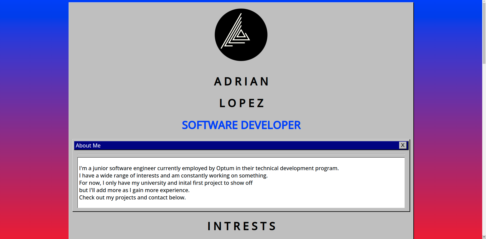

# This project and the info on the website is depreciated

# TL;DR

This is my own personal website. It's my first attempt
at a react based website. It was mostly meant to be a project
to help me learn about the technology. Feel free to offer feeback
or look at the code.

Take a look at the website [here]().

## Design choice and dependencies

I used a number of resources for the desgin and creation of
this website.

| Topic | Resource |
|-------|-----------|
| CSS Theme | [aesthetic-css](https://torch2424.github.io/aesthetic-css/#elementsButton) |
| Framework | react.js |
| Email client | [email.js](https://www.emailjs.com/) |
| Linter | [standardjs](https://standardjs.com/#usage) |
| Host | |
| Package manager | [Yarn](https://yarnpkg.com/) | 

## Who am I?

Just a junior developer...

## Available Scripts To Run Locally

First clone the project gather the dependencies.

In the project directory, you can run:

### `yarn start`

Runs the app in the development mode.\
Open [http://localhost:3000](http://localhost:3000) to view it in the browser.

The page will reload if you make edits.\
You will also see any lint errors in the console.

### `yarn test`

Launches the test runner in the interactive watch mode.\
See the section about [running tests](https://facebook.github.io/create-react-app/docs/running-tests) for
 more information.

### `yarn build`

Builds the app for production to the `build` folder.\
It correctly bundles React in production mode and optimizes the build for the best performance.

The build is minified and the filenames include the hashes.\
Your app is ready to be deployed!

See the section about [deployment](https://facebook.github.io/create-react-app/docs/deployment) for more
information.

